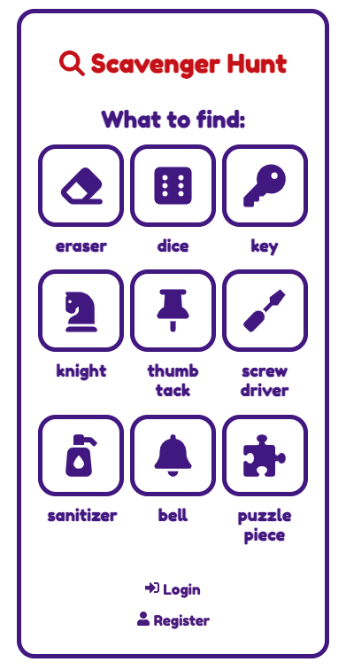
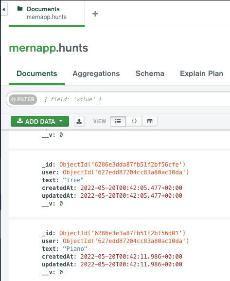
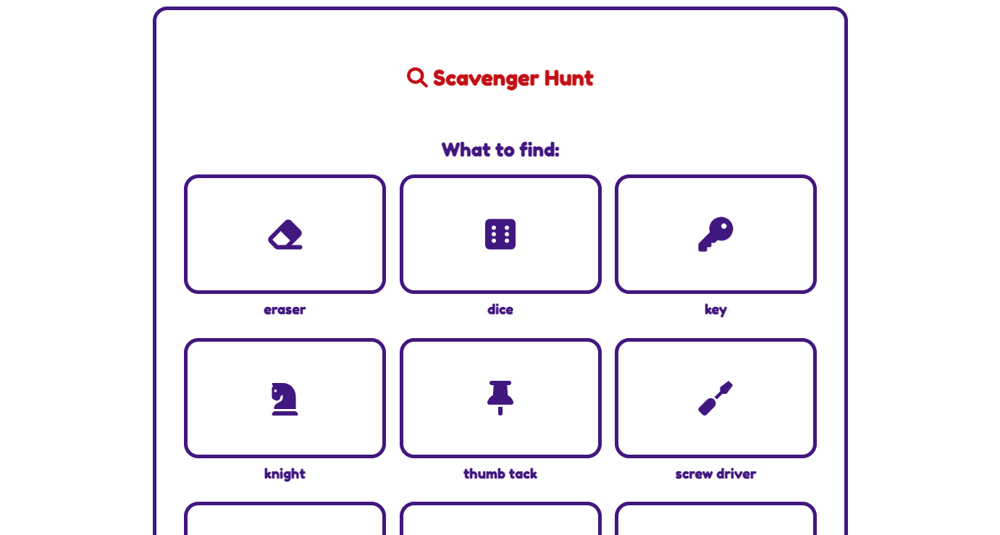
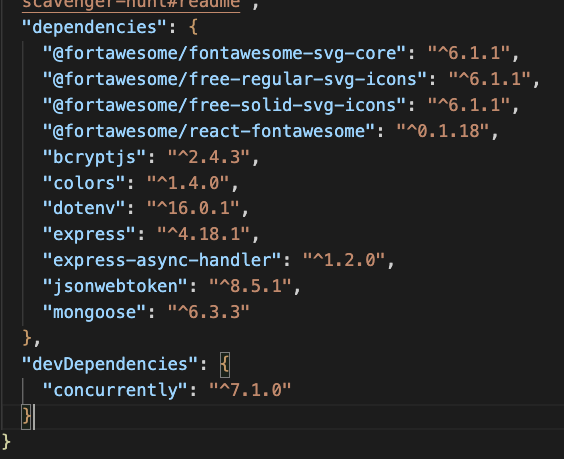

# Scavenger Hunt

Scavenger Hunt is my final project for coding boot camp 2022. It's a MERN full stack application wish means it uses React for the front end, MongoDB for databases, and Express and Node.js for the server application layer.

The idea is that someone who is resoponsible for others, be that a teacher, parent or manager, has a fun way to entertain in the space they are in. All they need to do is make sure everyone has a device, and then they can run a scavenger hunt. At home parents can get their kids to collect items, in an office, a manager could get their team to have a bit of fun as a warm up before an importaint meeting. This activity is simple, get's people on their feet for a short amount of time and can be a friendly competition. 

## Elevator pitch

Scavenger Hunt helps you create and record real world search and find games to play with kids, in the office or on a larger scale in your community.

## User Story

```
As A supervisor,
I WANT a fun way to captivate and entertain in a real world enviroment,
SO THAT everyone is excited and engaged.

```
## User Story

```
GIVEN a website to record record real world search and find games,
WHEN I visit the app, 
THEN I'm presented with an instant scavenger hunt game.
WHEN I click on an item,
THEN the item is marked as found.
WHEN I sign up,
THEN I have my own personal User account.
WHEN I sign in,
THEN I can store my own personal items to search for.
WHEN I return to the site,
THEN I can access my own stored items.
```

## Final application:

[Scavenger Hung on Heroku - Click to view](https://scavengerhunt2022.herokuapp.com/)



## Project requirements

``` Use React for the front end. ```

The app uses React for the front end, including passing of props, use of components, and use of hooks including useState and the Redux toolkit. 

``` Use GraphQL with a Node.js and Express.js server. ```

The project uses Node.js and Express.js. I have worked with GraphQL and love it. Unfortunatly, I was unable to get GraphQL working in this website and so used a restful APIs. 

``` Use MongoDB and the Mongoose ODM for the database. ```

I used MongoDB for my databases, with MongoDB Atlas for storage. I particularly loved MongoDB Atlas when it came to deploying as everything was pretty much already set up! I also used MongoDB Compass to view my data.




``` Use queries and mutations for retrieving, adding, updating, and deleting data. ```

The app is set up with full CRUD routing in the backend. Setting this up and accessing this with Insomnia wasn't a big challenge, however connecting this to the frontend with React was a bit of a headache. 

``` Be deployed using Heroku (with data). ```

[Scavenger Hung on Heroku - Click to view](https://scavengerhunt2022.herokuapp.com/)

``` Have a polished UI. ```
``` Be responsive. ```

The app has a minimalistic mobile first design. It is responsive and scales to any mobile or computer screen. 



``` Be interactive (i.e., accept and respond to user input). ```

The app has multipul interactive features, including creating a user with form data, signing in, buttons that resond and change the state of the view, and storage, manipulation and retreval of data when logged in.

```Include authentication (JWT). ```

The app has full JWT authentication using the JSON Web Token and BCrypt.js packages. I knew this would be the most difficult part of the project so I focused on it as my first priority.

```Protect sensitive API key information on the server.```

Sensitive API key infomation was stored in .env files using the DotENV package, and then also on MongoDB Atlas when deployed.

## Development



### Technologies Used


Frontend:


Server:

- [Node.js](https://nodejs.org/en/)
- [Insomnia](https://insomnia.rest/)
- [Express](http://expressjs.com/)

Database:

Security:
- [Bcrypt](https://www.npmjs.com/package/bcrypt)


### Challenges

### Future Development
